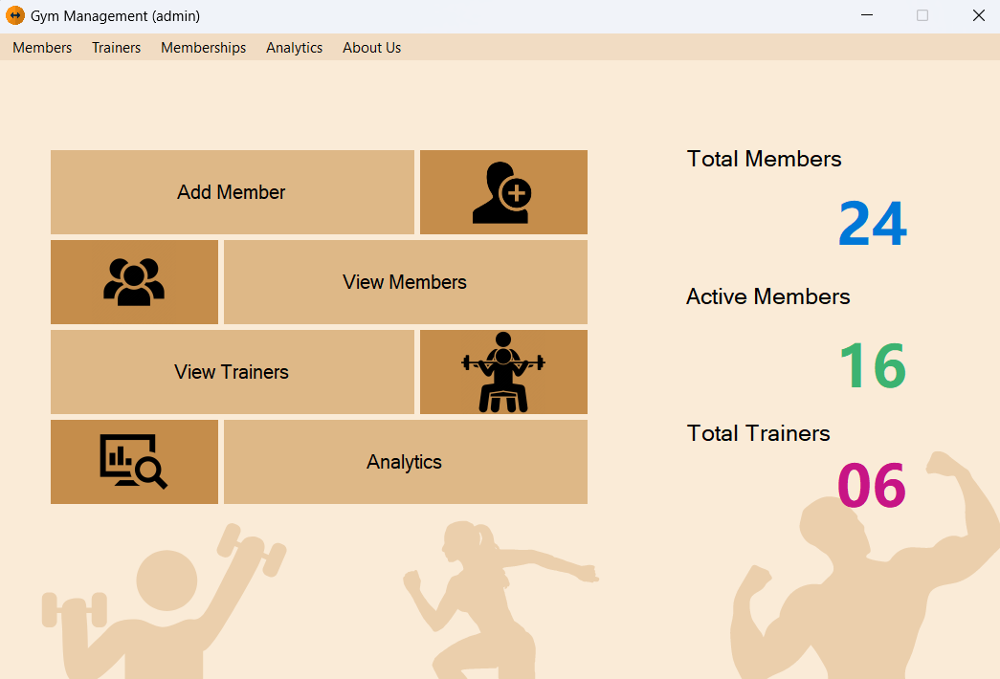
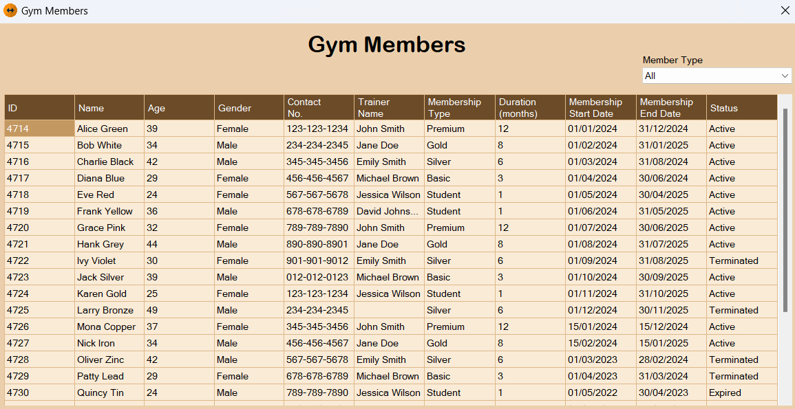
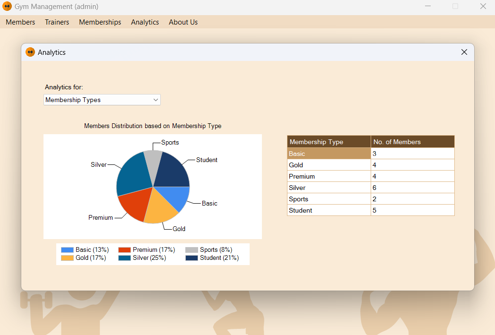

# GYM Management System

## Overview

The GYM Management System is a comprehensive application developed using C# WinForms and SQL database. This system provides functionalities to efficiently manage gym members, memberships, and trainers. It includes features for adding, editing, and removing records, along with analytics to monitor and display the growth of various membership categories. The system is designed with a user-friendly interface to ensure ease of use.

## Features

- **Member Management:** Add, edit, and remove gym members.
- **Membership Management:** Handle different membership categories with ease.
- **Trainer Management:** Manage gym trainers with functionalities to add, edit, and remove trainers.
- **Analytics:** Integrated analytics to track the growth of membership categories.
- **User Interface:** A well-designed UI that enhances user experience.

## Screenshots






## Installation

1. Clone the repository:
    ```bash
    git clone https://github.com/BilalHaider20/Gym-management-system.git
    ```
2. Open the project in your preferred IDE.
3. Restore the NuGet packages.
4. Build and run the application.

## Usage

- Navigate through the main menu to access member, membership, and trainer management sections.
- Use the analytics dashboard to view growth trends in membership categories.

## Database Schema

The application uses a **SQL Server** database named `Gym-Database`. The full schema (with `CREATE TABLE` statements) is available in [`DatabaseSchema.sql`](./DatabaseSchema.sql).

### Tables

#### `MembershipTypes`
| Column | Type | Notes |
|---|---|---|
| `MembershipTypeID` | `INT IDENTITY` | Primary Key |
| `TypeName` | `VARCHAR(100)` | Plan name (e.g. "Monthly", "Annual") |
| `Description` | `VARCHAR(500)` | Benefits / details of the plan |
| `DurationMonths` | `INT` | Length of the plan in months |
| `Price` | `DECIMAL(10,2)` | Cost in PKR |

#### `Staff`
| Column | Type | Notes |
|---|---|---|
| `StaffID` | `INT IDENTITY` | Primary Key |
| `Staff_Name` | `VARCHAR(100)` | Full name of the trainer |
| `Phone` | `VARCHAR(20)` | Contact number |
| `Position` | `VARCHAR(100)` | Role (e.g. "Head Trainer", "Nutritionist") |

#### `Members`
| Column | Type | Notes |
|---|---|---|
| `MemberID` | `INT IDENTITY` | Primary Key |
| `MemberName` | `VARCHAR(100)` | Full name of the member |
| `DateOfBirth` | `DATETIME` | Used to calculate age (minimum 18 years) |
| `Gender` | `VARCHAR(10)` | `'Male'` or `'Female'` |
| `Phone` | `VARCHAR(20)` | Contact number |
| `MembershipTypeID` | `INT` | **FK → MembershipTypes.MembershipTypeID** |
| `TrainerID` | `INT` (nullable) | **FK → Staff.StaffID** — `NULL` if no trainer assigned |
| `MembershipStartDate` | `DATETIME` | Date the membership began |
| `MembershipEndDate` | `DATETIME` | Calculated: `DATEADD(month, DurationMonths, StartDate)` |
| `MembershipStatus` | `VARCHAR(20)` | `'Active'`, `'Expired'`, or `'Terminated'` |

### Relationships

```
MembershipTypes ──< Members >── Staff
  (required)          (FK)      (optional)
```

- `Members.MembershipTypeID` → `MembershipTypes.MembershipTypeID` (**INNER JOIN** – every member must have a plan)
- `Members.TrainerID` → `Staff.StaffID` (**LEFT JOIN** – trainer assignment is optional)

## Technologies Used

- **C# WinForms:** For building the user interface.
- **SQL Server:** For managing and storing gym data.
- **.NET Framework:** The application is built on the .NET Framework.

## License

This project is licensed under the MIT License - see the [LICENSE](LICENSE) file for details.

## Contact

If you have any questions or feedback, feel free to reach out via [haiderbilal306@gmail.com](mailto:haiderbilal306@gmail.com).

